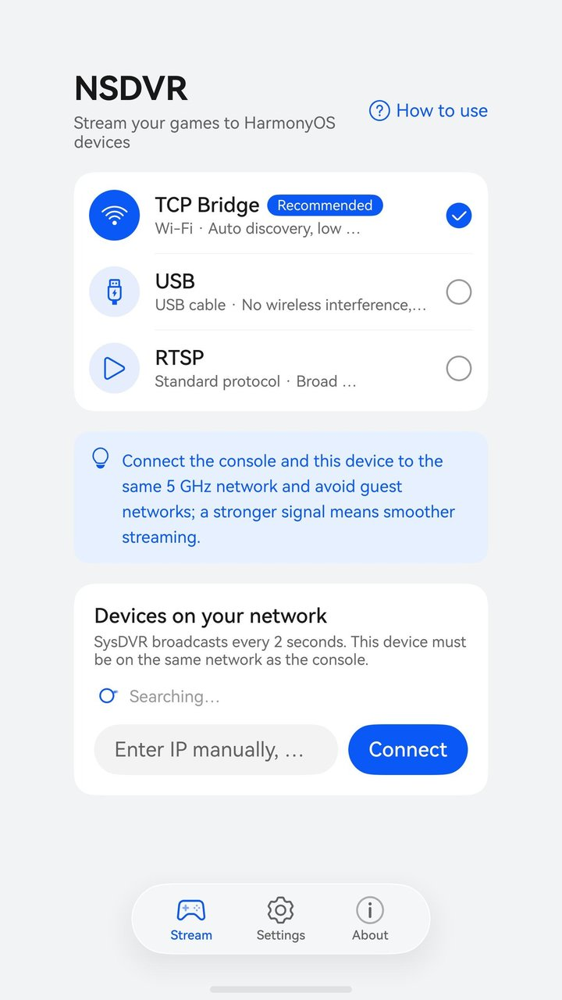
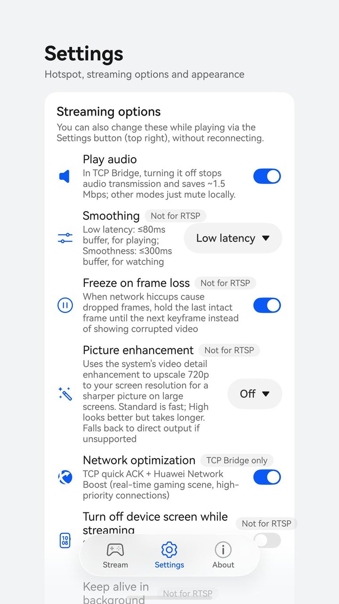

# NSDVR: a SysDVR client for HarmonyOS

**English** | [简体中文](README.zh-CN.md)

NSDVR receives the [SysDVR](https://github.com/exelix11/SysDVR) stream from a Nintendo Switch on HarmonyOS NEXT phones, tablets, PCs and foldables.
It supports all three SysDVR streaming modes and adds HarmonyOS-specific improvements: a dedicated 5 GHz hotspot, adaptive smoothing, freeze on frame loss, picture enhancement, network acceleration and background streaming with a live notification.
It works with the official SysDVR sysmodule; nothing needs to change on the Switch.

> NSDVR is an unofficial third-party client. It is not affiliated with or endorsed by Nintendo or the SysDVR project. SysDVR itself runs on a Switch with custom firmware.

<p align="center">
  
  &nbsp;
  
</p>

| Mode | Transport | Playback pipeline | Notes |
|---|---|---|---|
| TCP Bridge (recommended) | Wi-Fi: TCP 9911 video + 9922 audio, UDP 19999 discovery | Own pipeline: low-latency hardware decoding + OHAudio | NAL replay, smoothing, network optimization, background streaming |
| USB | Cable: one bulk IN/OUT endpoint, audio and video multiplexed | Own pipeline (same as above) | Tries usbfs ioctl first, falls back to `usbManager.bulkTransfer` |
| RTSP | Wi-Fi: `rtsp://IP:6666/`, RTP over TCP | [@ohos/ijkplayer](https://gitcode.com/CPF-ApplicationTPC/ohos_ijkplayer) (FFmpeg) | Most compatible; no NAL replay, smoothing or background streaming |

## Features

- **Automatic discovery** of Switch consoles on the local network; the last manually entered address is remembered.
- **Dedicated 5 GHz hotspot**: the phone creates a hotspot on channels 36–48 for the Switch to join directly, preferring the channel of the phone's current Wi-Fi. It can start automatically when the app opens and stops when the app exits.
- **Smoothing** (adaptive jitter buffer): *Low latency* (default, 20–80 ms buffer), *Smooth* (40–300 ms) or off. Audio stays aligned with video.
- **Freeze on frame loss**: when frames are lost on the network, the picture holds the last good frame until the next keyframe instead of breaking up (gives up after 3 s).
- **VSync-aligned presentation**: frames are scheduled to the display refresh for even motion.
- **Picture enhancement**: the system detail enhancer upscales the 720p stream to the real on-screen resolution (Standard / High).
- **Background streaming**: keeps receiving in the background for 5 min / 30 min / 2 h with a live notification, and catches up to the newest frame within a few hundred ms when you return.
- **Detailed stats**: receive/display frame rate, bitrate, frame loss, freezes, stutter, present jitter, buffers and the Switch's free memory, also logged to a CSV file.
- **Adaptive layouts** for phones, tablets, PCs and foldables, light and dark themes, and Simplified Chinese, Traditional Chinese and English.

## Architecture

```
Switch (SysDVR sysmodule)
  ├─ TCP Bridge: UDP 19999 broadcast + TCP 9911/9922 (hello → 16-byte handshake → result → [18-byte header + payload]...)
  ├─ USB: VID 18D1 / PID 4EE0, hello → handshake (audio and video in one request) → one bulk transfer per packet
  └─ RTSP: rtsp://IP:6666/ (H.264 + L16 48 kHz stereo)
  ▼
core/  (plain C++17, shared by HarmonyOS and the desktop tools)
  sysdvr_protocol   headers, handshake and broadcast parsing (protocol 02 and 03)
  stream_source     StreamSource interface + PacketDispatcher (error packets, NAL replay table, stats)
  tcp_bridge        TCP Bridge: two channels, reconnects, CCCCCCCC resync, UDP discovery
  usb_stream        USB: handshake, byte-stream parsing, re-handshake when the Switch resends hello
  gop_cache         GOP since the latest keyframe, for fast resume from the background
  frame_pacer       smoothing: adaptive buffer from the p90 of arrival jitter
  frame_loss        detects lost frames from timestamp gaps
  ext_audio         decoders for the experimental audio codecs (see below)
  ▼
harmony/entry/src/main/cpp/  (libentry.so)
  video_decoder     OH_VideoDecoder (surface mode, low latency) → XComponent NativeWindow, VSync scheduling, freeze on loss
  video_enhancer    detail enhancement (Video Processing Engine)
  audio_player      OHAudio renderer (low-latency path) with adaptive buffering
  usb_host          usbfs ioctl transport / ArkTS bulkTransfer fallback
  session           any StreamSource → decoder and audio; pause rendering in the background, resume in the foreground
  napi_init         ArkTS bindings
  ▼
harmony/entry/src/main/ets/
  pages/Index.ets   app shell and the player page (landscape full screen, tap to show controls, lock, quick settings)
  views/            Stream, Settings and About tabs, the guide, the hotspot sheet
  common/           hotspot, USB, RTSP player, background keep-alive, network acceleration, stats, i18n, preferences
```

## Repository layout

| Path | Contents |
|---|---|
| `core/` | Platform-independent protocol core |
| `harmony/` | DevEco Studio project (open this folder in DevEco Studio) |
| `third_party/opus/` | libopus decoder sources (BSD-3-Clause), used by the experimental audio codecs |
| `tools/mock_sysdvr.py` | Simulates the Switch sysmodule, so you can test without a Switch |
| `tools/make_test_h264.swift` | Generates a test video with macOS VideoToolbox (no ffmpeg needed) |
| `tools/cli_client.cpp` | Desktop command-line client built on the same core; can record from a real Switch |
| `tools/test_e2e.sh` | End-to-end protocol tests and unit tests |
| `tools/ohos/` | Offline checks without DevEco: native cross-compile, ArkTS type check and linter |
| `docs/nsdvr-ext-protocol.md` | Experimental protocol extension |
| `screenshot/` | Screenshots shown in this README |
| `.github/workflows/build.yml` | CI: tests and unsigned builds, published to Releases for `v*` tags |

## Getting started

### 1. Desktop protocol tests (optional, about 40 s)

```sh
sh tools/test_e2e.sh
```

### 2. Run on a HarmonyOS device

The repository does not include signing configurations. Generate your own debug signature first.

**Command line** (official DevEco CLI: `npm install -g @deveco/deveco-cli@stable`, requires DevEco Studio):

```sh
cd harmony
devecocli auth login            # sign in with your Huawei developer account (opens a browser)
devecocli device list           # check that the device is connected (developer mode and USB debugging on)
devecocli signature generate    # generate a debug signature into build-profile.json5
devecocli run                   # build, install and launch
devecocli log                   # view logs
```

**DevEco Studio**:

1. Open the `harmony/` folder with DevEco Studio 5.0 or later and wait for the sync to finish.
2. In `File > Project Structure > Signing Configs`, check *Automatically generate signature* (requires a Huawei account).
3. Enable developer mode and USB debugging on the device, connect it and press Run.

Keep your signing configuration local and do not commit it. Emulators have no hardware H.264 decoder, so they can only be used to check the UI.

### 3a. No Switch: simulate one on a Mac

```sh
swift tools/make_test_h264.swift test.h264 30      # generate a 30 s test video
python3 tools/mock_sysdvr.py --h264 test.h264      # simulate the Switch, broadcasting on the LAN
```

Connect the device and the Mac to the same Wi-Fi; "SysDVR 6.3" appears in the app automatically, or enter the Mac's IP address manually.
Allow python3 if the macOS firewall asks. The picture shows a scrolling gradient, color bars and a moving white block; the black and white strip at the top encodes the frame number, which helps spot stutter and frame loss.

### 3b. With a Switch

1. Install SysDVR 6.x on the Switch and set the mode to **TCP Bridge** in SysDVR Settings.
2. Start a game that supports video capture (games where holding the capture button records a clip).
3. Put the device and the Switch on the same network, or turn on the dedicated hotspot in the app and connect the Switch to it, then tap the console to connect.

For USB, connect the Switch through an OTG adapter (USB-C male to USB-A female) and a USB-A to USB-C cable. With a direct USB-C to USB-C cable the phone negotiates the device role and cannot see the Switch.

You can also check the Switch side with the desktop CLI first:

```sh
sh tools/build_cli.sh
./build/sysdvr_cli scan                                  # find the Switch
./build/sysdvr_cli 192.168.1.23 --seconds 10 --video out.h264 --audio out.pcm
ffplay -f h264 out.h264                                  # if ffmpeg is installed
```

### Offline checks without DevEco (optional)

Download the OpenHarmony 5.0 SDK ([Huawei Cloud mirror](https://repo.huaweicloud.com/openharmony/os/5.0.0-Release/), on macOS pick `L2-SDK-MAC-M1-PUBLIC.tar.gz`) and extract `native-*.zip` and `ets-*.zip`:

```sh
OHOS_NATIVE=<sdk>/native sh tools/ohos/check_native.sh                   # cross-compile libentry.so
ETS_SDK=<sdk>/ets PROJ=$PWD/harmony node tools/ohos/arkts_check.js       # ArkTS type check + linter
```

### Logs

```sh
hdc hilog | grep SysDVR
```

## Unsigned builds

Every push is built by GitHub Actions ([`.github/workflows/build.yml`](.github/workflows/build.yml)), and every `v*` tag
publishes an **unsigned** HAP with its SHA-256 to [Releases](../../releases). The signed version is distributed through
Huawei AppGallery and is built separately.

HarmonyOS only installs signed packages, so the unsigned HAP has to be signed with your own certificate first:

- You need a Huawei developer account, plus a debug certificate and a debug profile for your device from AppGallery
  Connect. The signing tool, `hap-sign-tool.jar`, comes with DevEco Studio and the Command Line Tools for HarmonyOS
  (`sdk/default/openharmony/toolchains/lib/`).
- A profile is issued for one bundle name, and `wilk.sysdvr.next` is registered to the publisher's account. If you
  cannot get a profile for it, building from source is the simplest route: change `bundleName` in
  `harmony/AppScope/app.json5` to your own and follow [Run on a HarmonyOS device](#2-run-on-a-harmonyos-device).
- Certificates and profiles expire; sign again with renewed ones when they do.

```sh
java -jar hap-sign-tool.jar sign-app -mode localSign -signAlg SHA256withECDSA \
  -keystoreFile your.p12 -keystorePwd <store password> -keyAlias <alias> -keyPwd <key password> \
  -appCertFile your.cer -profileFile your.p7b \
  -inFile NSDVR-<version>-unsigned.hap -outFile NSDVR-<version>.hap
hdc install NSDVR-<version>.hap
```

The CI build uses [springtwr/harmonyos-clt](https://github.com/springtwr/harmonyos-clt), a community Docker image of
Huawei's Command Line Tools for HarmonyOS (26.0.0.851), pinned by digest.

## Quick settings and smoothing

During playback, tap "Settings" in the top right corner to open the quick settings. All of these **apply immediately without reconnecting** and are saved for next time:

| Option | What it does |
|---|---|
| Audio | Turning it off closes the audio connection, so the Switch stops sending audio and saves about 1.5 Mbps (audio is uncompressed PCM) |
| Smoothing | Feeds frames to the decoder at the pace of the Switch timestamps (jitter buffer), trading a little latency for smoothness. The buffer adapts to the measured jitter (90th percentile of the last ~3 s plus a margin). Large stalls are not absorbed; after them the player catches up to the newest frame. *Low latency* (default): 20–80 ms; *Smooth*: 40–300 ms |
| Freeze on frame loss | Holds the last good frame until the next keyframe when frames are lost (on by default) |
| Picture enhancement | Off / Standard / High; about 15 ms of extra latency per frame |
| Stats | Shows or hides the stats overlay |
| Keep connected in background | Off / 5 min / 30 min / 2 h |

Simulated smoothing results (`tools/frame_pacer_test.cpp`, 60 s at 30 fps, *Smooth* level):

| Network model | Without smoothing | With smoothing |
|---|---|---|
| Unstable hotspot (0–120 ms jitter, 300 ms stall every 10 s) | 522 stutters | 18 stutters, 143 ms buffer, 242 ms average latency |
| Typical Wi-Fi (0–40 ms jitter) | 277 stutters | 0 stutters, 68 ms buffer, 93 ms average latency |
| Stable network (no jitter) | 0 stutters | 0 stutters, buffer drops to 40 ms |

On a real device over the dedicated hotspot, *Low latency* reduced visible stutter from about 108 to 11 per minute and present jitter from 15.7 ms to 3.6 ms, with a median buffer of 30 ms.

**Adaptive audio buffering**: starts at 80 ms, grows by 40 ms after each underrun, and shrinks by 20 ms every 5 s after 15 s without underruns (minimum 60 ms). The upper limit follows the smoothing level, and with smoothing on the audio buffer is at least as long as the video buffer to keep them aligned.

**Stats log**: every connection writes one line per second to `stats.csv` in the app sandbox, handy for comparing settings:

```sh
hdc file recv -b wilk.sysdvr.next /data/storage/el2/base/haps/entry/files/stats.csv ./
```

In the overlay, `recv x / show y fps` is the received and rendered frame rate. If both are low, the problem is the network or the Switch; if frames are received but not shown, it is the client.

## Network tips

- The dedicated 5 GHz hotspot gives the most stable results: 29.4–30 fps in testing when the phone is not connected to another Wi-Fi network.
- If the phone is also connected to another Wi-Fi network on a different channel, the radio has to switch between channels, which costs noticeably more frames. The app warns about this.
- 2.4 GHz hotspots and busy networks often cannot sustain 30 fps. Turning off audio helps.
- Guest networks (hotels, offices) usually isolate clients: the app sees the Switch's broadcast but cannot connect to it.

## Dedicated hotspot

The system hotspot APIs that can set the band, channel or security (`wifiManager.enableHotspot`, `setHotspotConfig`) are system APIs and not available in the public SDK, and the system's personal hotspot cannot pick a channel.

Instead, the app creates a Wi-Fi Direct group with the public `createGroup` API, with the phone as the group owner. A group owner is effectively a WPA2 soft AP that ordinary devices such as the Switch can join. It only needs the normal `GET_WIFI_INFO` permission.

- Band `GO_BAND_5GHZ`; `goFreq` (API 23+) tries 5180–5240 MHz, i.e. channels 36–48 that the Switch accepts, preferring the channel of the phone's current Wi-Fi and otherwise the least crowded one. If 5 GHz fails, it falls back to 2.4 GHz.
- Wi-Fi Direct mandates WPA2-PSK (CCMP), which the Switch supports.
- The network name and password are saved, so the Switch reconnects automatically next time.

## Background streaming

Choose 5 min, 30 min (default) or 2 h for "Keep connected in background"; "Off" disconnects as soon as the app goes to the background.

**In the background** the connection stays open and keeps receiving without rendering. The decoder and audio player are released, and only the GOP since the latest keyframe is kept in memory (up to 24 MB / 900 packets). A live notification shows the connection state, the data received and the remaining time. Tap it to return; swipe it away to stop streaming.

**Back in the foreground** a new decoder is created and the cached GOP is fed in at once. Old frames are decoded without being shown, so the picture jumps straight to the newest frame without waiting for the next keyframe (272 ms on a Mate 60 Pro).

| Constraint | Approach |
|---|---|
| Apps are suspended a few seconds after going to the background | A **DATA_TRANSFER** continuous task, since receiving without rendering is a continuous download |
| DATA_TRANSFER requires a system live notification updated regularly | Updated every 5 s in the background; uses the built-in download template, so no Live View Kit entitlement is needed |
| Continuous tasks can only be requested in the foreground | Requested when tapping "Connect", before entering the player |
| Apps without AVSession are muted and frozen when playing audio in the background | The audio player is released in the background and recreated on return |

Live View Kit (custom capsule and card live views) requires per-scenario entitlements in AppGallery Connect, and game streaming is not one of the supported scenarios.

## Implementation notes (compared with the official client)

- **Two connections with separate handshakes and reconnects**: losing the video stream does not affect audio, as in the official `TCPBridge.cs`.
- **Resync**: the Switch's socket buffers are small, so data can be lost even inside a TCP stream. On an invalid header, the client scans byte by byte for `CC CC CC CC` to realign.
- **NAL replay**: when the picture is static, the sysmodule sends only a slot number for repeated keyframes (64 slots). The client caches keyframes and replays the cached frame.
- **Decoding starts at an IDR**: P frames are dropped until the first IDR. If that IDR has no SPS/PPS, the Switch's fixed parameter sets are prepended, as the sysmodule does.
- **Low latency**: the decoder runs with `OH_MD_KEY_VIDEO_ENABLE_LOW_LATENCY`, and frames are presented at the next VSync after decoding.

## Experimental extension

The client includes an experimental, backward-compatible protocol extension (audio compression with PCM 24 kHz, IMA ADPCM or Opus, switchable at runtime, plus server-side diagnostics) for an experimental SysDVR build, [NSDVR-server](https://github.com/onewilk/NSDVR-server) (not tested on real hardware yet). These options stay hidden unless the connected console advertises support, or developer options are enabled (tap the version number in About seven times). With the official SysDVR nothing changes. See [docs/nsdvr-ext-protocol.md](docs/nsdvr-ext-protocol.md). For end-to-end tests without a Switch, `tools/test_e2e.sh` uses the simulated server from that repository, cloned next to this one as `../NSDVR-server`.

## Known limitations

- **Audio/video sync**: audio and video play independently as soon as they arrive, like the official client's fallback mode; with smoothing on, the audio buffer is at least as long as the video buffer.
- **RTSP latency**: ijkplayer is tuned for real-time LAN playback (no prebuffering, drop when late, direct hardware output), but latency is higher than TCP Bridge. Streaming pauses in the background and reconnects on return.
- **Switch screen turning back on**: with "Turn off Switch screen" on, turning audio off during a TCP Bridge session turns the Switch screen back on. This comes from the sysmodule and is reported upstream ([SysDVR#402](https://github.com/exelix11/SysDVR/issues/402)).

## License

GPL-2.0, the same as SysDVR (the protocol implementation follows SysDVR's documentation and source). Third-party components: libopus (BSD-3-Clause), ijkplayer / FFmpeg (LGPL-2.1+, shipped as dynamic libraries).

The test vectors in `tools/ext_vectors/` contain a short excerpt of a CC BY 3.0 music track; credit and details are in its README.
