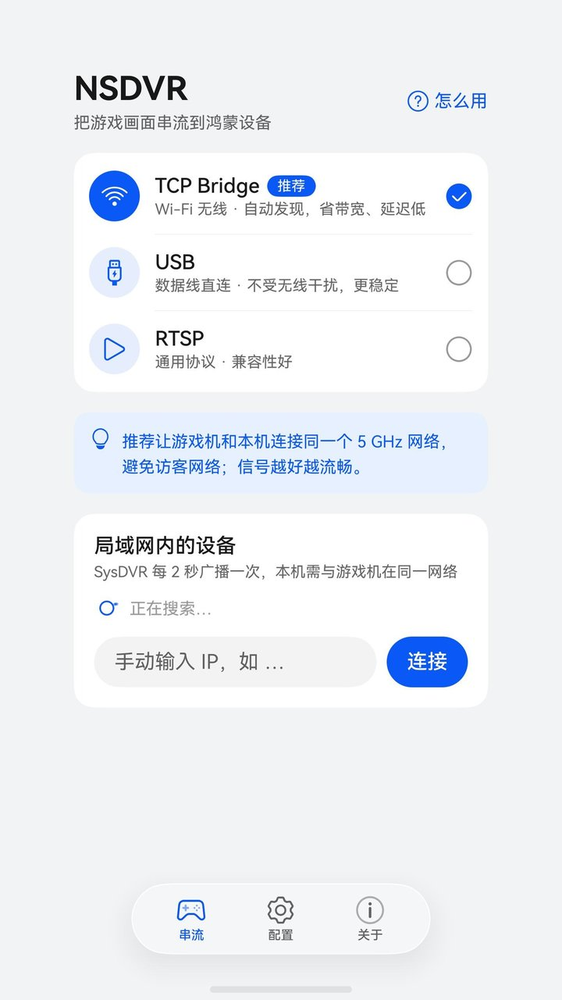
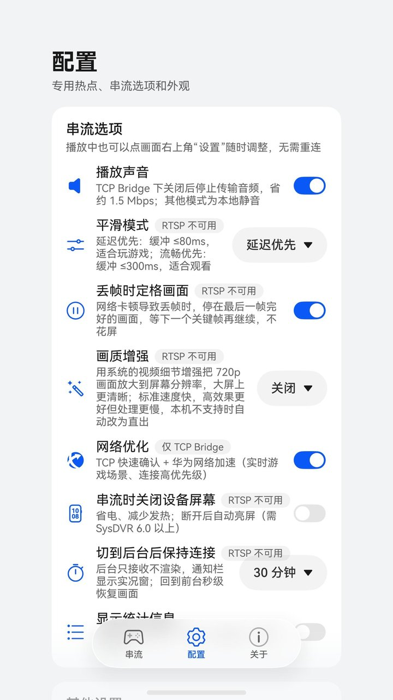
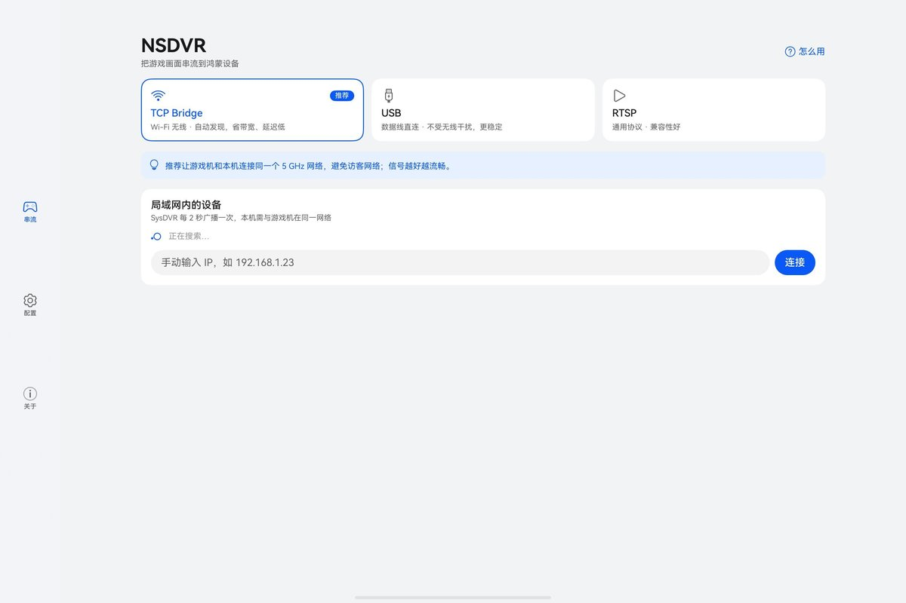
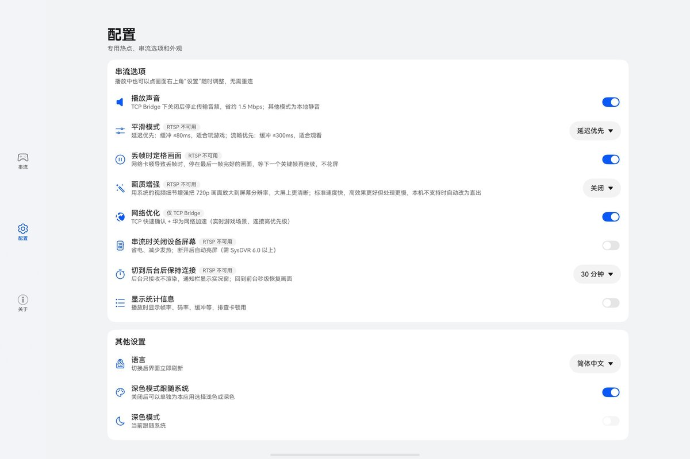
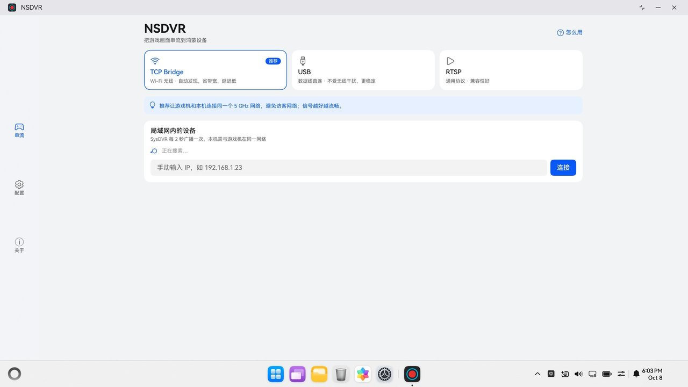
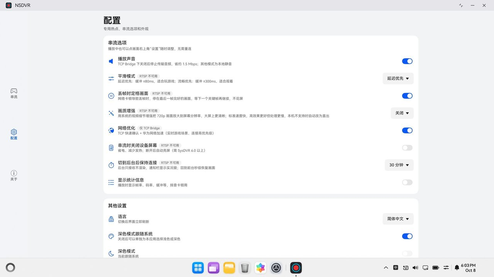

# NSDVR：SysDVR 的鸿蒙客户端

[English](README.md) | **简体中文**

NSDVR 在 HarmonyOS NEXT 手机、平板、PC 和折叠屏上接收 Nintendo Switch 的 [SysDVR](https://github.com/exelix11/SysDVR) 串流。
它完整支持 SysDVR 的三种串流模式，并利用鸿蒙系统能力做了多项体验优化：专用 5 GHz 热点、自适应平滑、丢帧定格、画质增强、网络加速，以及带实况窗的后台保持。
配合官方 SysDVR sysmodule 使用，Switch 端不需要任何改动。

> NSDVR 是非官方的第三方客户端，与任天堂及 SysDVR 项目没有隶属或背书关系。SysDVR 本身需要运行在装有自制系统的 Switch 上。

<p align="center">
  
  &nbsp;
  
  <br><sub>手机</sub>
</p>

<p align="center">
  
  &nbsp;
  
  <br><sub>平板</sub>
</p>

<p align="center">
  
  &nbsp;
  
  <br><sub>PC</sub>
</p>

| 模式 | 传输 | 播放管线 | 说明 |
|---|---|---|---|
| TCP Bridge（推荐） | Wi-Fi：TCP 9911 视频 + 9922 音频，UDP 19999 自动发现 | 自研：硬解低延迟 + OHAudio | 支持 NAL 重放、平滑模式、网络优化、后台保持 |
| USB | 数据线：单个 bulk IN/OUT 端点，音视频复用 | 自研（同上） | 优先直接对 usbfs 发 ioctl，不行就退回 `usbManager.bulkTransfer` 兼容传输 |
| RTSP | Wi-Fi：`rtsp://IP:6666/`，RTP over TCP | [@ohos/ijkplayer](https://gitcode.com/CPF-ApplicationTPC/ohos_ijkplayer)（FFmpeg） | 兼容性好；没有 NAL 重放，平滑和后台保持不可用 |

## 功能

- **自动发现**局域网里的 Switch；手动输入的地址会记住。
- **专用 5 GHz 热点**：手机直接在 36–48 信道建热点，让 Switch 一跳直连；手机连着 Wi-Fi 时优先用同一信道。可以设成打开 App 时自动开启，退出 App 时自动关闭。
- **平滑模式**（自适应抖动缓冲）：“延迟优先”（默认，缓冲 20–80 ms）、“流畅优先”（40–300 ms）或关闭，声音会跟着对齐。
- **丢帧定格**：网络丢帧时画面停在最后一帧完好的画面，等下一个关键帧再继续，不再花屏（超过 3 秒放弃等待）。
- **按屏幕刷新节奏上屏**：每帧排到 VSync 上，画面更均匀。
- **画质增强**：用系统的细节增强把 720p 画面放大到屏幕实际分辨率（标准 / 高）。
- **后台保持**：切到后台后继续接收 5 分钟 / 30 分钟 / 2 小时，通知栏显示实况窗；回到前台几百毫秒内追到最新画面。
- **详细统计**：收/显帧率、码率、丢帧、定格、卡顿、上屏抖动、缓冲、Switch 剩余内存等，同时写入 CSV 文件。
- **多设备自适应布局**（手机、平板、PC、折叠屏），浅色/深色主题，简体中文、繁体中文和英文界面。

## 架构

```
Switch (SysDVR sysmodule)
  ├─ TCP Bridge：UDP 19999 广播 + TCP 9911/9922（hello → 16 字节握手 → 结果码 → [18 字节包头 + 负载]...）
  ├─ USB：VID 18D1 / PID 4EE0，hello → 握手（一次订阅音视频）→ 每包一次 bulk 传输
  └─ RTSP：rtsp://IP:6666/（H.264 + L16 48kHz 立体声）
  ▼
core/  （纯 C++17，鸿蒙与桌面工具共用）
  sysdvr_protocol   包头、握手、广播解析（协议 02 与 03）
  stream_source     串流来源接口 StreamSource + 公共包分发 PacketDispatcher（错误包、NAL 重放表、统计）
  tcp_bridge        TCP Bridge：双通道连接、断线重连、CCCCCCCC 重同步、UDP 发现
  usb_stream        USB：握手、按字节流解析、Switch 重发 hello 时自动重新握手
  gop_cache         最近一个关键帧起的 GOP，用于从后台快速恢复画面
  frame_pacer       平滑模式：按到达抖动的第 90 百分位自适应缓冲
  frame_loss        根据时间戳断档发现丢帧
  ext_audio         实验音频编码的解码器（见下文）
  ▼
harmony/entry/src/main/cpp/  （libentry.so）
  video_decoder     OH_VideoDecoder（Surface 模式，低延迟）→ XComponent 的 NativeWindow，VSync 排期，丢帧定格
  video_enhancer    画质增强（视频处理引擎细节增强）
  audio_player      OHAudio 渲染器（优先低时延通路）+ 自适应缓冲
  usb_host          usbfs ioctl 传输 / ArkTS bulkTransfer 兼容传输
  session           任意 StreamSource → 解码和音频；后台暂停渲染、前台恢复
  napi_init         给 ArkTS 的接口
  ▼
harmony/entry/src/main/ets/
  pages/Index.ets   应用框架和播放页（横屏全屏、点画面显示控件、锁定、快捷设置）
  views/            串流、配置、关于三个页签，使用说明，专用热点配置弹窗
  common/           专用热点、USB、RTSP 播放器、后台保持、网络加速、统计、多语言、设置
```

## 目录

| 路径 | 说明 |
|---|---|
| `core/` | 协议核心，与平台无关 |
| `harmony/` | DevEco Studio 工程（直接用 DevEco 打开这个目录） |
| `third_party/opus/` | libopus 解码源码（BSD-3-Clause），实验音频编码使用 |
| `tools/mock_sysdvr.py` | 模拟 Switch 端 sysmodule，没有 Switch 也能测 |
| `tools/make_test_h264.swift` | 用 macOS 自带 VideoToolbox 生成测试视频（不需要 ffmpeg） |
| `tools/cli_client.cpp` | 桌面命令行客户端，和鸿蒙端用同一份 core，可以从真 Switch 抓流 |
| `tools/test_e2e.sh` | 端到端协议测试和单元测试 |
| `tools/ohos/` | 不开 DevEco 的离线检查：native 交叉编译、ArkTS 类型检查与 linter |
| `docs/nsdvr-ext-protocol.zh-CN.md` | 实验扩展协议 |
| `screenshot/` | README 里展示的截图 |
| `.github/workflows/build.yml` | CI：测试和未签名构建，`v*` 标签发布到 Releases |

## 快速开始

### 1. 桌面自测协议（可选，约 40 秒）

```sh
sh tools/test_e2e.sh
```

### 2. 在鸿蒙设备上运行

仓库里不含签名配置，需要先生成自己的调试签名。

**命令行方式**（华为官方 DevEco CLI：`npm install -g @deveco/deveco-cli@stable`，依赖本机已装的 DevEco Studio）：

```sh
cd harmony
devecocli auth login            # 登录华为开发者账号（会打开浏览器）
devecocli device list           # 确认设备已连上（需打开开发者模式和 USB 调试）
devecocli signature generate    # 自动生成调试签名，写入 build-profile.json5
devecocli run                   # 编译、安装、启动
devecocli log                   # 看日志
```

**DevEco Studio 方式**：

1. 用 DevEco Studio（5.0 或更高）打开 `harmony/` 目录，等待 Sync 完成。
2. `File > Project Structure > Signing Configs`，勾选 *Automatically generate signature*（需要登录华为账号）。
3. 设备打开开发者模式和 USB 调试，连上电脑，点运行。

签名配置只留在本地，不要提交。模拟器没有硬件 H.264 解码，只能用来看界面。

### 3a. 没有 Switch：用 Mac 模拟

```sh
swift tools/make_test_h264.swift test.h264 30      # 生成 30 秒测试视频
python3 tools/mock_sysdvr.py --h264 test.h264      # 模拟 Switch，默认向局域网广播
```

设备和 Mac 连同一个 Wi-Fi，App 里会自动出现“SysDVR 6.3”；没出现的话手动输入 Mac 的 IP。
macOS 防火墙如果弹窗，放行 python3。画面是滚动渐变 + 彩条 + 移动白块，顶部黑白条是帧号，可以用来肉眼判断卡顿和丢帧。

### 3b. 有 Switch

1. Switch 装好 SysDVR（6.x），在 SysDVR Settings 里把模式改成 **TCP Bridge**。
2. 启动一个支持录像的游戏（能长按截图键录视频的游戏）。
3. 设备和 Switch 连同一个网络，或者在 App 里打开专用热点让 Switch 连上，再点设备连接。

USB 模式要用 OTG 转接头（USB-C 公转 USB-A 母）加 USB-A 转 USB-C 线连接 Switch。用 C 对 C 线直连时，手机会被协商成从设备，看不到 Switch。

也可以先用桌面 CLI 确认 Switch 那一侧正常：

```sh
sh tools/build_cli.sh
./build/sysdvr_cli scan                                  # 找 Switch
./build/sysdvr_cli 192.168.1.23 --seconds 10 --video out.h264 --audio out.pcm
ffplay -f h264 out.h264                                  # 装了 ffmpeg 的话可以直接看
```

### 不开 DevEco 的离线检查（可选）

下载 OpenHarmony 5.0 SDK（[华为云镜像](https://repo.huaweicloud.com/openharmony/os/5.0.0-Release/)，macOS 选 `L2-SDK-MAC-M1-PUBLIC.tar.gz`），解出其中的 `native-*.zip` 和 `ets-*.zip`：

```sh
OHOS_NATIVE=<sdk>/native sh tools/ohos/check_native.sh                   # 交叉编译 libentry.so
ETS_SDK=<sdk>/ets PROJ=$PWD/harmony node tools/ohos/arkts_check.js       # ArkTS 类型检查 + linter
```

### 看日志

```sh
hdc hilog | grep SysDVR
```

## 未签名安装包

每次推送都由 GitHub Actions 构建（[`.github/workflows/build.yml`](.github/workflows/build.yml)），每个 `v*` 标签会把
**未签名**的 HAP 和它的 SHA-256 发布到 [Releases](../../releases)。签名版通过华为应用市场分发，另外单独构建。

鸿蒙只安装签过名的包，所以未签名的 HAP 要先用你自己的证书签名：

- 需要华为开发者账号，以及在 AppGallery Connect 为你的设备申请的调试证书和调试 Profile。签名工具 `hap-sign-tool.jar`
  在 DevEco Studio 和鸿蒙命令行工具里都有（`sdk/default/openharmony/toolchains/lib/`）。
- Profile 是按包名签发的，而 `wilk.sysdvr.next` 注册在发布者的账号下。如果拿不到这个包名的 Profile，最简单的办法是
  从源码构建：把 `harmony/AppScope/app.json5` 里的 `bundleName` 改成你自己的，再按 [在鸿蒙设备上运行](#2-在鸿蒙设备上运行) 操作。
- 证书和 Profile 都有有效期，过期后用新的重新签名。

```sh
java -jar hap-sign-tool.jar sign-app -mode localSign -signAlg SHA256withECDSA \
  -keystoreFile your.p12 -keystorePwd <密钥库密码> -keyAlias <别名> -keyPwd <密钥密码> \
  -appCertFile your.cer -profileFile your.p7b \
  -inFile NSDVR-<版本>-unsigned.hap -outFile NSDVR-<版本>.hap
hdc install NSDVR-<版本>.hap
```

CI 构建用的是社区维护的鸿蒙命令行工具 Docker 镜像 [springtwr/harmonyos-clt](https://github.com/springtwr/harmonyos-clt)
（26.0.0.851），按 digest 锁定。

## 快捷设置与平滑模式

横屏播放时点右上角“设置”弹出快捷面板，下面几项都**即时生效，不用断开重连**，并会保存下来：

| 选项 | 作用 |
|---|---|
| 播放声音 | 关闭时直接断开音频连接，Switch 就不再发音频，省下约 1.5 Mbps（音频是不压缩的 PCM） |
| 平滑模式 | 按 Switch 时间戳匀速把帧送进解码器（抖动缓冲），用少量延迟换流畅。缓冲按实测抖动自动调整（最近约 3 秒到达波动的第 90 百分位再加一点余量）。偶发的大卡顿不去硬扛，卡完快速追回最新画面。“延迟优先”（默认）20–80 ms，“流畅优先”40–300 ms |
| 丢帧定格 | 丢帧时停在最后一帧完好的画面，等下一个关键帧再继续（默认开启） |
| 画质增强 | 关闭 / 标准 / 高；每帧约多 15 ms 延迟 |
| 显示统计信息 | 统计浮层的显示与隐藏 |
| 切后台保持连接 | 关闭 / 5 分钟 / 30 分钟 / 2 小时 |

平滑模式的模拟测试（`tools/frame_pacer_test.cpp`，60 秒 30 fps，“流畅优先”档）：

| 网络模型 | 不平滑 | 平滑 |
|---|---|---|
| 不稳定热点（抖动 0–120 ms，每 10 秒卡 300 ms） | 卡顿 522 次 | 卡顿 18 次，缓冲 143 ms，平均延迟 242 ms |
| 一般 Wi-Fi（抖动 0–40 ms） | 卡顿 277 次 | 卡顿 0 次，缓冲 68 ms，平均延迟 93 ms |
| 稳定网络（无抖动） | 卡顿 0 次 | 卡顿 0 次，缓冲自动降到 40 ms |

真机通过专用热点实测：“延迟优先”把肉眼可见的卡顿从每分钟约 108 次降到 11 次，上屏抖动从 15.7 ms 降到 3.6 ms，缓冲中位数 30 ms。

**音频自适应缓冲**：起步 80 ms；每欠载一次加 40 ms；连续 15 秒不欠载，每 5 秒减 20 ms，最少 60 ms。上限跟随平滑档位；开平滑时音频至少缓冲和视频一样久，保证音画对齐。

**统计日志**：每次连接每秒写一行到应用沙箱的 `stats.csv`，可以用 hdc 拉出来对比不同设置的效果：

```sh
hdc file recv -b wilk.sysdvr.next /data/storage/el2/base/haps/entry/files/stats.csv ./
```

浮层里的“收 x / 显 y fps”是收到和实际渲染的帧率：两个都低，说明是网络或 Switch 端的问题；收得够但显示得少，才是客户端的问题。

## 网络建议

- 专用 5 GHz 热点最稳定：手机不同时连别的 Wi-Fi 时，实测 29.4–30 fps。
- 手机同时连着另一个不同信道的 Wi-Fi 时，无线芯片要在两个信道间来回切换，丢帧明显增多，App 会给出提示。
- 2.4 GHz 热点和拥挤的网络经常撑不住 30 fps，关掉声音会好很多。
- 酒店、公司等访客 Wi-Fi 一般有客户端隔离：能收到 Switch 的广播，但连不上。

## 专用热点

能设置频段、信道、加密方式的系统热点接口（`wifiManager.enableHotspot`、`setHotspotConfig`）都是系统接口，公开 SDK 里没有；系统设置里的个人热点也不能选信道。

所以 App 用公开的 Wi-Fi 直连接口 `createGroup` 建组，手机作为组主（GO）。组主本质上就是一个 WPA2 软热点，Switch 这样的普通设备可以当成 Wi-Fi 连接。只需要普通权限 `GET_WIFI_INFO`。

- 频段 `GO_BAND_5GHZ`；`goFreq`（API 23+）在 5180–5240 MHz 中选，也就是 Switch 能识别的 36–48 信道：优先用手机当前 Wi-Fi 的信道，否则选周边占用最轻的。5 GHz 不行时退回 2.4 GHz。
- Wi-Fi 直连规范规定为 WPA2-PSK（CCMP），正好是 Switch 支持的。
- 网络名和密码固定保存，Switch 记住一次后下次自动连上。

## 后台保持连接

“切到后台后保持连接”可选 5 分钟 / 30 分钟（默认）/ 2 小时；选“关闭”则切后台就断开。

**切到后台**：连接不断，照常收流但不渲染。解码器和音频播放器都释放掉，只在内存里保留最近一个关键帧起的画面数据（上限 24 MB / 900 包）。通知栏实况窗显示连接状态、已接收流量和剩余时间；点实况窗回到画面，左滑删除即停止串流。

**回到前台**：新建解码器，把缓存的 GOP 一次性送进去。旧帧只解码不上屏，画面直接跳到最新一帧，不用等下一个关键帧（Mate 60 Pro 实测 272 ms）。

| 约束 | 做法 |
|---|---|
| 应用切后台几秒后会被系统挂起 | 申请 **DATA_TRANSFER** 长时任务，“只接收不渲染”本质是持续下载 |
| DATA_TRANSFER 要求用系统实况窗定期更新进度 | 后台每 5 秒更新一次；用长时任务自带的下载模板，不需要 Live View Kit 的场景权益 |
| 长时任务只能在前台申请 | 点“连接”时先申请好，再进播放页 |
| 未接入 AVSession 的应用在后台出声会被静音并冻结 | 切后台时释放音频播放器，回前台时重建 |

Live View Kit（自定义胶囊和卡片样式的实况窗）需要在 AppGallery Connect 按场景申请权益，游戏串流不在开放的场景里。

## 实现要点（对应 SysDVR 官方客户端）

- **两条连接各自握手、各自重连**：视频流断了不影响音频流，和官方 `TCPBridge.cs` 的行为一致。
- **重同步**：Switch 端 socket 缓冲很小，极端情况下 TCP 流里也会丢数据。发现包头不合法时，逐字节找 `CC CC CC CC` 重新对齐。
- **NAL 重放**：画面静止时，sysmodule 对重复的关键帧只发一个槽位号（64 个槽）。客户端缓存关键帧，收到槽位号就把缓存的那一帧重新送解码器。
- **从 IDR 开始解码**：刚连上时先丢掉 P 帧，等到第一个 IDR 再送解码器。如果这个 IDR 前面没带 SPS/PPS，就补上 Switch 固定的那组参数（与 sysmodule 注入方式相同）。
- **低延迟**：解码器开启 `OH_MD_KEY_VIDEO_ENABLE_LOW_LATENCY`，解出一帧就在下一次 VSync 上屏。

## 实验扩展

客户端带有一个向后兼容的实验扩展协议，配合 SysDVR 实验版 [NSDVR-server](https://github.com/onewilk/NSDVR-server)（还没有在真机上测试过）使用：音频压缩（PCM 24 kHz、IMA ADPCM、Opus，运行中可切换）和服务端诊断数据。只有连接的 Switch 表明支持时，或者打开了开发者选项（关于页连点版本号 7 次），这些选项才会显示；使用官方 SysDVR 时一切照旧。详见 [docs/nsdvr-ext-protocol.zh-CN.md](docs/nsdvr-ext-protocol.zh-CN.md)。没有 Switch 时，`tools/test_e2e.sh` 用该仓库里的模拟服务器做端到端测试（克隆到本仓库旁边，目录名 `../NSDVR-server`）。

## 已知限制

- **音画同步**：画面和声音各自到了就播，与官方客户端的兜底模式相同；开平滑时音频缓冲至少与视频缓冲一样长。
- **RTSP 延迟**：ijkplayer 已按局域网实时场景调参（不预缓冲、落后丢帧、硬解直出），但延迟仍高于 TCP Bridge。切到后台会暂停拉流，回前台自动重连。
- **Switch 屏幕重新亮起**：开着“串流时关闭 Switch 屏幕”时，在 TCP Bridge 串流中途关掉声音，Switch 屏幕会重新亮起。这是 sysmodule 的行为，已反馈给上游（[SysDVR#402](https://github.com/exelix11/SysDVR/issues/402)）。

## 许可证

GPL-2.0，与 SysDVR 相同（协议实现参考了 SysDVR 的文档和源码）。第三方组件：libopus（BSD-3-Clause）、ijkplayer / FFmpeg（LGPL-2.1+，以动态库形式随包分发）。

`tools/ext_vectors/` 的测试向量里有一小段 CC BY 3.0 授权的音乐，出处和说明见该目录的 README。
